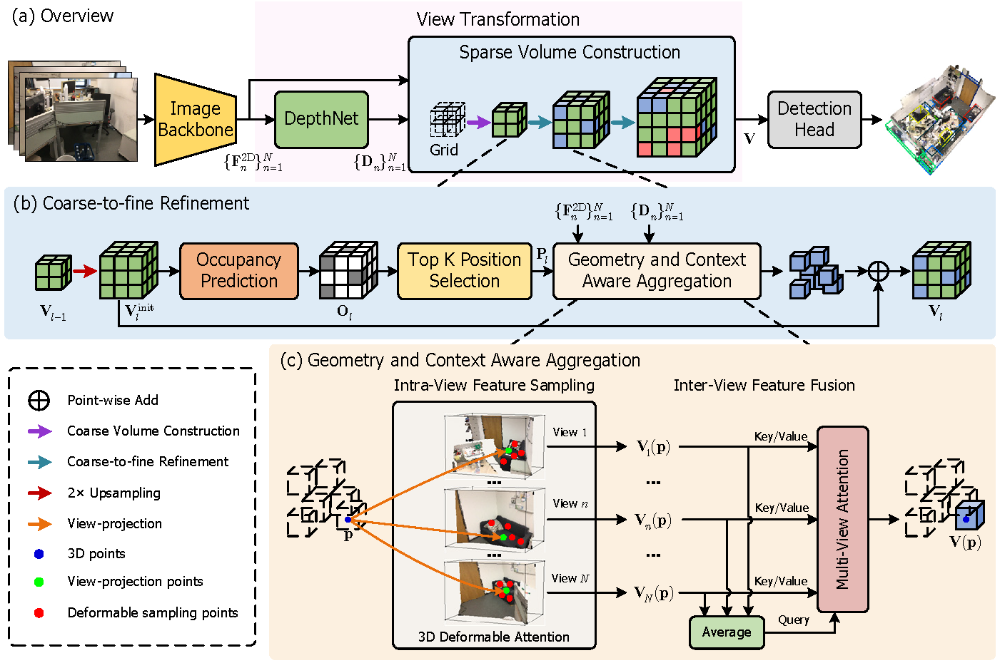

# Boosting Multi-View Indoor 3D Object Detection via Adaptive 3D Volume Construction

## 🚀 News

- **2025.7.xx** [**arXiv**](https://arxiv.org) preprint released.
- **2025.6.26** accepted by ICCV2025.

## To Do

- upload pretrained models.
- update the training & evaluation instructions.

## Abstract

This work presents SGCDet, a novel multi-view indoor 3D object detection framework based on adaptive 3D volume construction. Unlike previous approaches that restrict the receptive field of voxels to fixed locations on images, we introduce a geometry and context aware aggregation module to integrate geometric and contextual information within adaptive regions in each image and dynamically adjust the contributions from different views, enhancing the representation capability of voxel features. Furthermore, we propose a sparse volume construction strategy that adaptively identifies and selects voxels with high occupancy probabilities for feature refinement, minimizing redundant computation in free space. Benefiting from the above designs, our framework achieves effective and efficient volume construction in an adaptive way. Better still, our network can be supervised using only 3D bounding boxes, eliminating the dependence on ground-truth scene geometry. Experimental results demonstrate that SGCDet achieves state-of-the-art performance on the ScanNet, ScanNet200 and ARKitScenes datasets.

## Method



Schematics and detailed architectures of SGCDet. (a) Overview of SGCDet, which consists of an image backbone to extract image features, a view transformation module to lift image features to 3D volumes, and a detection head to predict 3D bounding boxes. (b) Details of the coarse-to-fine refinement in our sparse volume construction strategy. (c) Details of our geometry and context aware aggregation module.

## Getting Started

step 1. Refer to [install.md](./docs/install.md) to install the environment.

step 2. Refer to [train_and_eval.md](./docs/train_and_eval.md) for training and evaluation.

## Model Zoo

We provide the pretrained weights on ScanNet, ScanNet200, and ARKitScenes datasets, reproduced with the released codebase.

## License

This project is released under the Apache 2.0 license.

## Contact

If you have any other problems, feel free to post questions in the issues section or contact Runmin Zhang (runmin_zhang@zju.edu.cn).

## Acknowledgement

Many thanks to these exceptional open source projects:
- [mmdet3d](https://github.com/open-mmlab/mmdetection3d)
- [ImVoxelNet](https://github.com/filaPro/imvoxelnet)
- [ImGeoNet](https://github.com/ttaoREtw/ImGeoNet)
- [NeRF-Det](https://github.com/facebookresearch/NeRF-Det)
- [MVSDet](https://github.com/Pixie8888/MVSDet)
- [CN-RMA](https://github.com/SerCharles/CN-RMA)
- [DFA3D](https://github.com/IDEA-Research/3D-deformable-attention)
- [CGFormer](https://github.com/pkqbajng/CGFormer)
- [SparseOcc](https://github.com/MCG-NJU/SparseOcc)
- [SEA-RAFT](https://github.com/princeton-vl/SEA-RAFT)

As it is not possible to list all the projects of the reference papers. If you find we leave out your repo, please contact us and we'll update the lists.

## Bibtex

If you find our work beneficial for your research, please consider citing our paper and give us a star:

```
@inproceedings{SGCDet_ICCV25,
}
```
